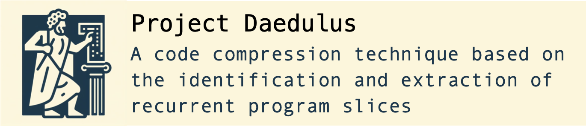

# Daedalus

<p align="center">
  </br>
</p>

Daedalus is an LLVM Pass that maps Instructions to Program Slices. Our end goal is to use program slices as a unit of program compression, by outlining common slices; hence, making code shorter.

# Table of Contents

- [Documentation](#docs)
- [Building](#building)
- [Running](#running)

## Docs

To generate the project's documentation, execute the following command from the root directory of the repository:

```shell
$ doxygen
```

The complete documentation will be generated inside the ```docs/``` folder. To view it, open ```docs/html/index.html``` in your web browser.

## Building

The preferred way to build Daedalus is as an out-of-tree LLVM pass.
You can do the following to compile and install it as a library:

```shell
$ mkdir build
$ cd build
$ cmake -DLLVM_DIR={path_to_llvm_project} ../
$ cmake --build .
```

## Running

After building Daedalus, you can extract program slices using a script we
have: `comp.sh`. This script will compile a C program and invoke Daedalus on
it:

``` shell
$ chmod +x comp.sh
$ ./comp.sh {path_to_test_file}
# ex
$ ./comp.sh tests/test1.ll
```

If, otherwise, you prefer to load and run the pass directly, you can simply
do:

``` shell
$ cd build
$ make
$ cd ..
$ opt -load-pass-plugin build/lib/libdaedalus.so -passes=daedalus -disable-output {path_to_test_file}
```

But, in this last case, remember that you must apply Daedalus onto a program written in the [LLVM IR](https://llvm.org/docs/LangRef.html).
