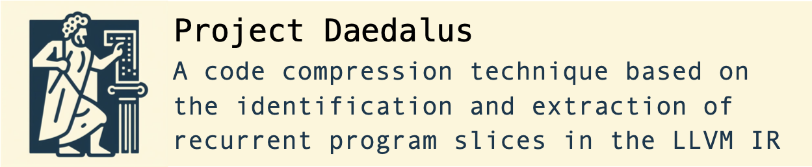

# Daedalus

<p align="center">
  </br>
</p>

Daedalus is an LLVM pass that maps instructions to program slices. Our goal is to use program slices as a unit of program compression by outlining common slices, thereby making code shorter.

# Table of Contents

- [Documentation](#documentation)
- [Building](#building)
- [Running](#running)

## Documentation

To generate the project's documentation, execute the following command from the root directory of the repository:

```shell
$ doxygen
```

The complete documentation will be generated inside the `docs/` folder. To view it, open `docs/html/index.html` in your web browser.

## Building

Daedalus is an out-of-tree LLVM pass. Therefore, you can compile and install it as a library by doing the following:

```shell
$ mkdir build
$ cd build
$ cmake -DLLVM_DIR={path_to_llvm_project} ../
$ cmake --build .
```

## Running

After building Daedalus, you can test it using the source files inside the `tests/` folder. Run the following sequence of commands in bash to generate test executables and IR files:

```shell
$ cd tests
$ ./generate_tests.sh -q
```

For a given test file name (without its extension), the following files are created:

Test Name: `test6.c`
- `test6.ll`: IR file created before running Daedalus;
- `test6.d.ll`: IR file created after running Daedalus;
- `test6.bin`: executable created before running Daedalus;
- `test6.d.bin`: executable created after running Daedalus;

If you prefer to run the pass directly, you can simply do the following:

```shell
$ clang -S -Xclang -disable-O0-optnone -emit-llvm {path_to_ll_file} -o {path_to_output_ll_file}
$ opt -S -passes=mem2reg,lcssa {path_to_output_ll_file} -o {path_to_output_ll_file}
$ opt -debug-only=daedalus -passes=daedalus -load-pass-plugin=path/to/lib/libdaedalus.so {path_to_ll_file} -o {path_to_output_ll_file} 2>&1
```
